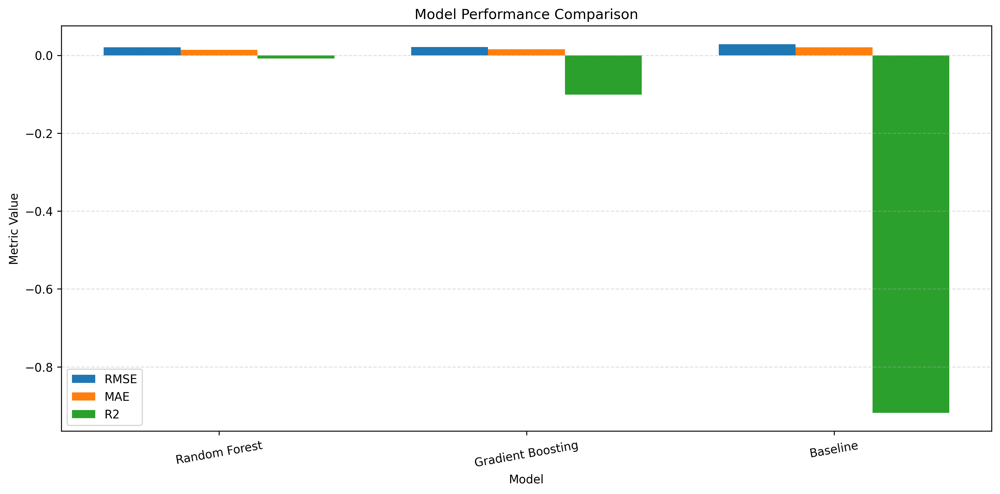
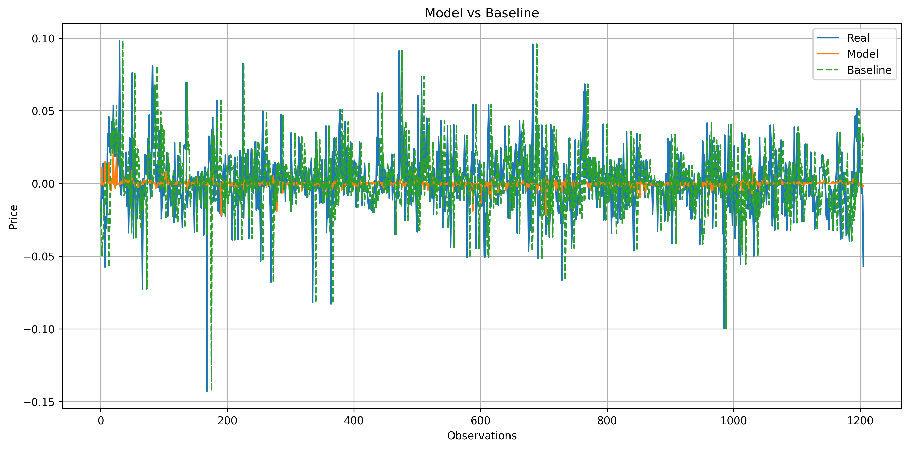
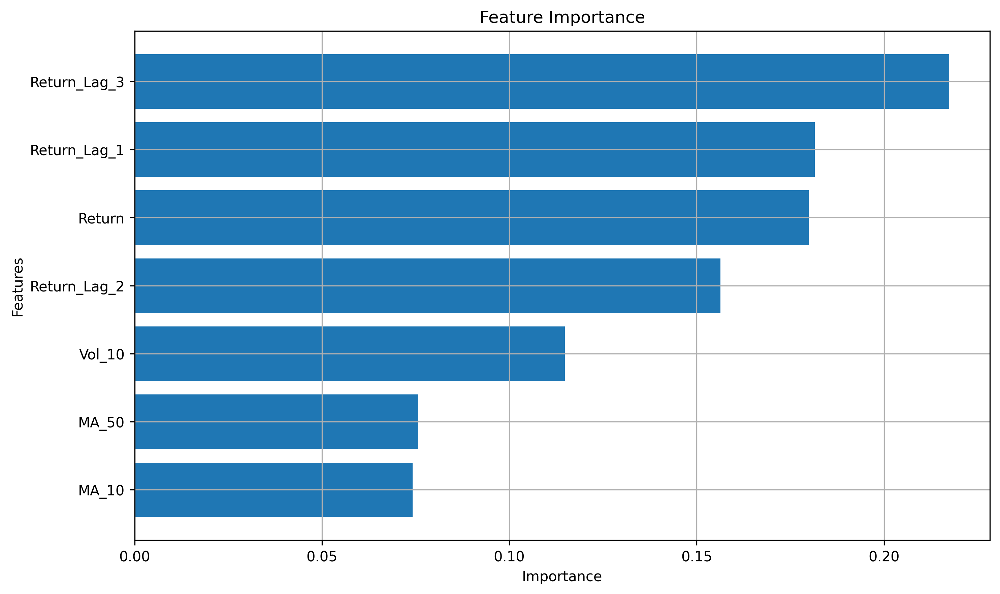

# Stock Market Analysis and Prediction

This project analyzes historical stock data from major tech companies and builds machine learning models to predict the next day's return.

The current pipeline compares three approaches:

- `Random Forest`
- `Gradient Boosting`
- `Baseline` using the current day's return as the next day's prediction

## Objective

Instead of predicting raw prices directly, the project reframes the problem as a return prediction task. This makes the target more stable and better suited for supervised learning.

## Current Results

The latest training and evaluation flow compares the two trained models against the baseline on the same test split.

| Model | RMSE | MAE | R2 |
| --- | ---: | ---: | ---: |
| Random Forest | 0.020637 | 0.014463 | -0.008135 |
| Gradient Boosting | 0.021563 | 0.015466 | -0.100594 |
| Baseline | 0.028464 | 0.020393 | -0.917832 |



## Main Takeaways

- `Random Forest` is the best-performing model in the current version.
- Both machine learning models outperform the baseline in `RMSE` and `MAE`.
- `Gradient Boosting` also improves over the baseline, but does not reach the same performance as `Random Forest`.
- The strongest gains came from reframing the task to returns and adding lag-based features.

## Features Used

The models are trained using the following predictors:

- `Return`
- `MA_10`
- `MA_50`
- `Vol_10`
- `Return_Lag_1`
- `Return_Lag_2`
- `Return_Lag_3`

## Generated Plots

Running the training script now saves model evaluation charts automatically in the `model_plots/` folder:

- `random_forest_predictions.png`
- `random_forest_feature_importance.png`
- `random_forest_vs_baseline.png`
- `gradient_boosting_predictions.png`
- `gradient_boosting_feature_importance.png`
- `gradient_boosting_vs_baseline.png`
- `model_performance_comparison.png`

These plots include:

- actual vs predicted values
- feature importance for each model
- model vs baseline comparisons
- a final comparison chart for `Random Forest`, `Gradient Boosting`, and `Baseline`

### Example Visuals





## Project Structure

```bash
stock-analysis/
|-- data/
|   |-- processed/
|   `-- raw/
|-- model_plots/
|-- notebooks/
|   `-- analysis.ipynb
|-- src/
|   |-- analysis.py
|   |-- data_collection.py
|   |-- feature_engineering.py
|   |-- preprocessing.py
|   |-- visualization.py
|   `-- models/
|       |-- evaluate.py
|       |-- predict.py
|       |-- train.py
|       `-- utils.py
|-- insights.md
|-- main.py
|-- requirements.txt
|-- train_model.py
`-- README.md
```

## Workflow

1. Load raw stock data
2. Engineer returns, moving averages, volatility, and lag features
3. Create the prediction target as the next day's return
4. Split the dataset using time order
5. Train `Random Forest` and `Gradient Boosting`
6. Compare both models with the baseline
7. Save evaluation plots in `model_plots/`

## How to Run

Install dependencies:

```bash
pip install -r requirements.txt
```

Run the full training and evaluation pipeline:

```bash
python train_model.py
```

## Notes

- The baseline is intentionally simple and serves as a reference point.
- In this project, lower `RMSE` and `MAE` indicate better predictive performance.
- The negative `R2` values show the task remains difficult, even though the trained models clearly improve over the naive baseline.
