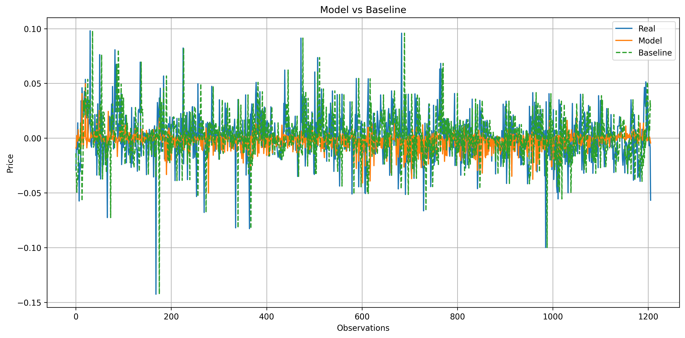
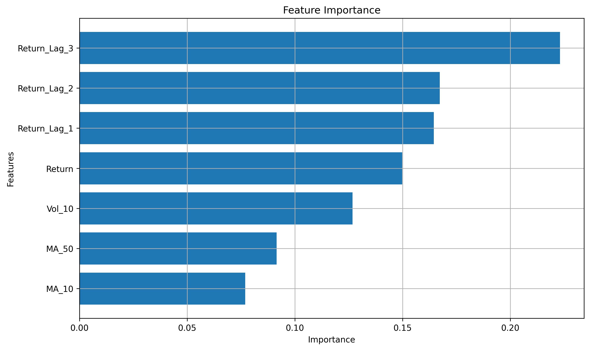

# Storytelling and Insights

## 1. Initial Hypothesis

The project started with a simple idea: use machine learning to predict stock market behavior and verify whether a trained model could beat a naive baseline.

At first, the focus was closer to direct price prediction, but that approach produced weak results and did not generalize well.

This was the first important signal:

- the problem formulation mattered as much as the model choice

## 2. Problem Reframing

The project improved when the target changed from raw prices to next-day returns.

This shift made the problem more realistic and more learnable because returns are:

- more stationary than raw prices
- better aligned with financial analysis
- more suitable for short-term forecasting experiments

That change created a much stronger base for modeling.

## 3. Feature Engineering Was the Turning Point

The strongest improvement came from feature engineering rather than from increasing model complexity.

The most useful additions were:

- lagged returns
- moving averages

These features helped the models capture short-term momentum and recent market behavior, which are more informative than raw price levels alone.

## 4. Model Comparison

The project now compares three approaches:

- `Random Forest`
- `Gradient Boosting`
- `Baseline`

Latest evaluation metrics:

| Model | RMSE | MAE | R2 |
| --- | ---: | ---: | ---: |
| Random Forest | 0.020637 | 0.014463 | -0.008135 |
| Gradient Boosting | 0.021563 | 0.015466 | -0.100594 |
| Baseline | 0.028464 | 0.020393 | -0.917832 |

What this shows:

- `Random Forest` is the strongest model in the current version
- `Gradient Boosting` also beats the baseline
- both trained models reduce prediction error compared with the naive approach
- even with these gains, the negative `R2` values confirm that return prediction remains a hard problem

## 5. What Changed in the Project

The project evolved from a single-model experiment into a more complete comparison pipeline.

It now includes:

- training multiple models
- evaluating against a baseline
- feature importance analysis
- automatic saving of plots in `model_plots/`
- a final visual comparison of model performance

This made the project more robust and easier to explain.

## 6. Market and Data Insights

Beyond the predictive models, the exploratory analysis still supports a few useful observations:

- some assets show much higher volatility than others
- large technology stocks tend to move with meaningful correlation
- short-term return behavior contains some learnable structure, but also a high level of noise

This explains why improvement is possible, but also why perfect prediction is unrealistic.

## 7. Main Learning

The biggest lesson from this project is clear:

- better framing and better features created more value than simply switching algorithms

The comparison between `Random Forest` and `Gradient Boosting` reinforced that model choice matters, but only after the data representation is strong enough.

## 8. Final Takeaway

This project reflects a realistic data science workflow:

1. start with a reasonable hypothesis
2. test against a baseline
3. observe failure or weak performance
4. reframe the problem
5. improve features
6. compare multiple models
7. document results visually and quantitatively

The final outcome is not just a better model, but a better understanding of what makes financial prediction pipelines more useful in practice.
